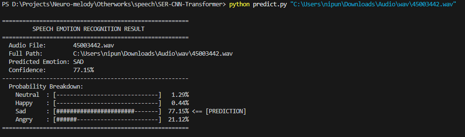

# SER-CNN-Transformer
# Speech Emotion Recognition — CNN-Transformer + Multidimensional Attention
Trained on IEMOCAP. Merges all into a unified training pipeline. Uses a ResNet-style CNN with SE attention, Mixup, label smoothing, cosine annealing, and comprehensive graphical statistics. Accuracy - 64.37% Demo Link - https://huggingface.co/spaces/NipunD58/SpeechEmotionRecognition Usage - Use
```bash
python predict.py path/to/audio.wav 
```
for making predictions using pretrained model Use
```bash
python predict.py path/to/audio.wav 
```
for training the model from scratch

## Highlights
- Hybrid CNN + Transformer backbone for robust speech representation
- Multidimensional Attention Mechanism for improved emotion discrimination
- Scripts for preprocessing, training, and inference on IEMOCAP features

## Requirements
```bash
pip install -r requirements.txt
```

## Quick Start

1. Preprocess IEMOCAP (optional if using built-in loader):
```bash
python preprocessing/process_IEMOCAP.py
```

2. Train a model with MFCC features (example):
```bash
python train_IEMOCAP.py -f mfcc -m CTMAM -b 128 -e 150 -l 0.001 -g 0
```

3. Run inference on an audio file (feature extraction + predict):
```bash
python predict.py --model-path data/IEMOCAP/model_CTMAM_mfcc_all.pth --file examples/sample.wav
```

Notes:
- Use `-g` to select GPU id (set to `-1` for CPU).
- Use `-f` to change feature type (e.g., `mfcc`, `fbank` if supported).

# Additional Information
This is a 2 in 4 of my emotion detection project in which I aim to use multiple types of data from camera to analyse the emotion of the user. This particular one is the Speech module. Aim of this particular segment - Take a audio from the user and display the emotions depicted in the audio Frontend - Gradio UI Backend - CNN-Transformer to detect emotions trained on IEMOCAP. UI/Output-


## Project Structure
- `train_IEMOCAP.py` — training entrypoint
- `predict.py` — inference script
- `models.py` — model definitions (CNN-Transformer and attention modules)
- `data_loader.py` — dataset and dataloader utilities
- `preprocessing/` — data processing helpers for IEMOCAP

## Pretrained Models & Checkpoints
- Example checkpoint included: `data/IEMOCAP/model_CTMAM_mfcc_all.pth` and metric/loss logs in the same folder.
- To evaluate or resume training, point `--model-path` to the checkpoint file.

## Evaluation
- Training script saves checkpoints and logs final metrics to `data/IEMOCAP/`.
- Add evaluation code or use `predict.py` to compute per-file predictions and aggregate metrics.

## License
MIT
